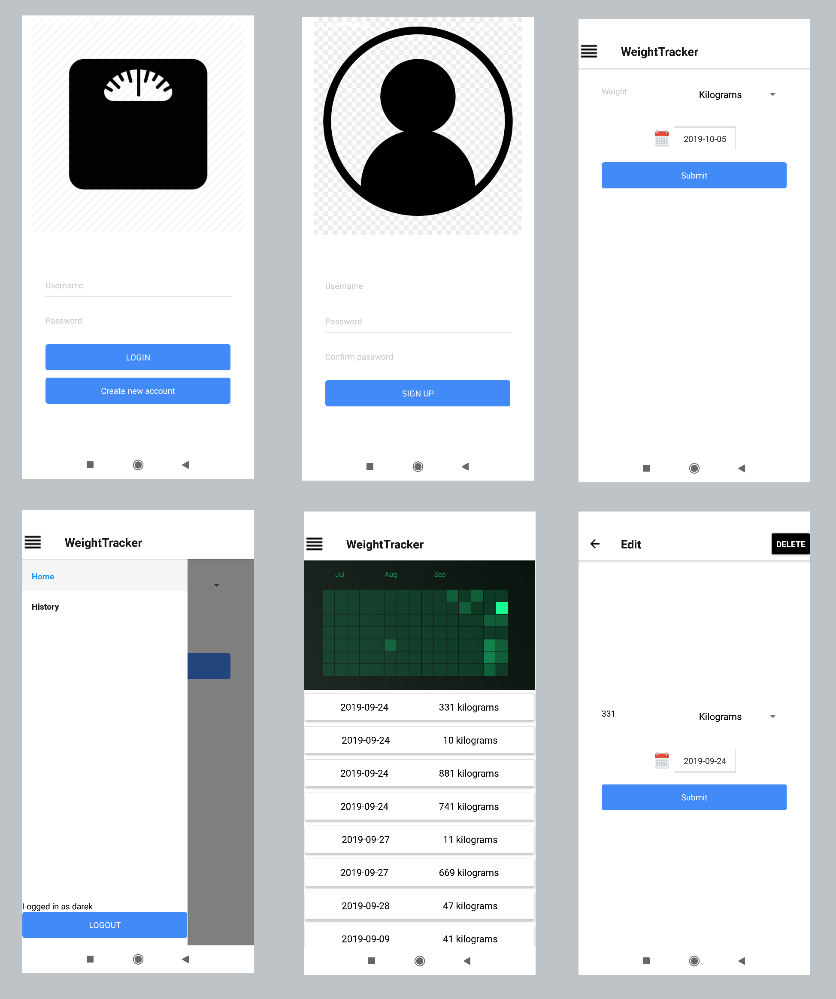

# WeightTracker

React Native mobile app + NestJS Server<br>
Simple CRUD app that let you track your weight.

## Screenshots


## Getting Started

These instructions will get you a copy of the project up and running on your local machine for development and testing purposes.

### Prerequisites

* NPM
* Expo

### Installing

1. Clone this repo
2. Set your own JWT and Postgres configuration (in ./server/src/config)
3. Run backend server

```
cd server
npm install
npm start
```
4. Modify /mobile/src/config/api.js for API_BASE_URL (tip: use ifconfig to get your local IP address)
5. Run mobile app
```
cd mobile
npm install
npm start
```

6. Scan QR code with Expo mobile app on your phone.


## Build with

* PostgreSQL
* Expo

### Backend:

* NodeJS
* NestJS
* TypeORM
* JWT
* PassportJS

### Frontend:

* React (with Hooks)
* React Native
* Redux and Redux Thunk
* React-Navigation
* Axios

## TODO
- [x] Add possibility to delete weight entity
- [ ] Improve the UI
- [ ] Write some tests
